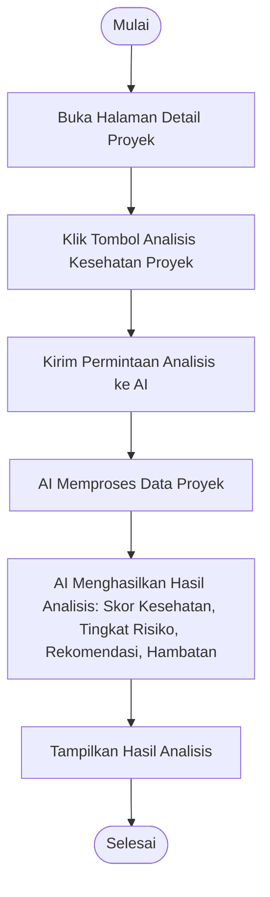

# Activity Diagram: Analisis Kesehatan Proyek

---

## Penjelasan Activity Diagram: Analisis Kesehatan Proyek

Activity Diagram ini menggambarkan alur kerja untuk melakukan analisis kesehatan proyek dengan AI di sistem Bitspace:

1. **Mulai**: Titik awal alur.
2. **Buka Halaman Detail Proyek**: Pengguna membuka halaman detail proyek.
3. **Klik Tombol Analisis Kesehatan Proyek**: Pengguna menekan tombol untuk meminta analisis kesehatan proyek.
4. **Kirim Permintaan Analisis ke AI**: Sistem mengirim permintaan beserta data proyek ke AI.
5. **AI Memproses Data Proyek**: AI memproses data proyek untuk menganalisis kesehatannya.
6. **AI Menghasilkan Hasil Analisis**: AI menghasilkan skor kesehatan, tingkat risiko, rekomendasi, dan hambatan potensial.
7. **Tampilkan Hasil Analisis**: Sistem menampilkan hasil analisis kepada pengguna.
8. **Selesai**: Titik akhir alur.
