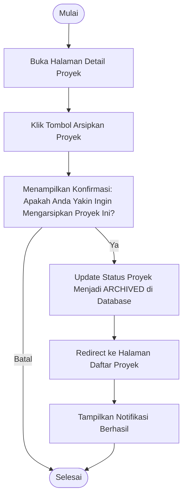

# Activity Diagram: Arsipkan Proyek

---

## Penjelasan Activity Diagram: Arsipkan Proyek

Activity Diagram ini menggambarkan alur kerja untuk mengarsipkan proyek di sistem Bitspace (hanya bisa dilakukan oleh Owner):

1. **Mulai**: Titik awal alur.
2. **Buka Halaman Detail Proyek**: Owner membuka halaman detail proyek yang ingin diarsipkan.
3. **Klik Tombol Arsipkan Proyek**: Owner menekan tombol untuk mengarsipkan proyek.
4. **Menampilkan Konfirmasi**: Sistem menampilkan pesan konfirmasi untuk memastikan apakah Owner yakin ingin mengarsipkan proyek.
   - **Batal**: Jika Owner memilih batal, proses selesai.
5. **Update Status Proyek Menjadi ARCHIVED di Database**: Sistem mengubah status proyek menjadi "ARCHIVED" di database.
6. **Redirect ke Halaman Daftar Proyek**: Sistem mengarahkan Owner ke halaman daftar proyek.
7. **Tampilkan Notifikasi Berhasil**: Sistem memberitahu Owner bahwa proyek berhasil diarsipkan.
8. **Selesai**: Titik akhir alur.
