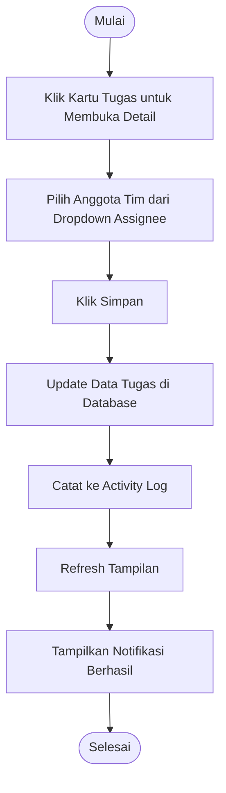

# Activity Diagram: Assign Tugas

---

## Penjelasan Activity Diagram: Assign Tugas

Activity Diagram ini menggambarkan alur kerja untuk menugaskan (assign) tugas ke anggota tim di sistem Bitspace (hanya bisa dilakukan oleh Owner):

1. **Mulai**: Titik awal alur.
2. **Klik Kartu Tugas untuk Membuka Detail**: Owner mengklik kartu tugas di kanban board untuk melihat detail tugas.
3. **Pilih Anggota Tim dari Dropdown Assignee**: Owner memilih anggota tim yang ingin ditugaskan dari dropdown.
4. **Klik Simpan**: Owner menekan tombol simpan.
5. **Update Data Tugas di Database**: Sistem menyimpan assignee baru ke database.
6. **Catat ke Activity Log**: Sistem mencatat perubahan ini ke activity log proyek.
7. **Refresh Tampilan**: Tampilan diperbarui untuk menampilkan assignee baru.
8. **Tampilkan Notifikasi Berhasil**: Sistem memberitahu Owner bahwa tugas berhasil ditugaskan.
9. **Selesai**: Titik akhir alur.
