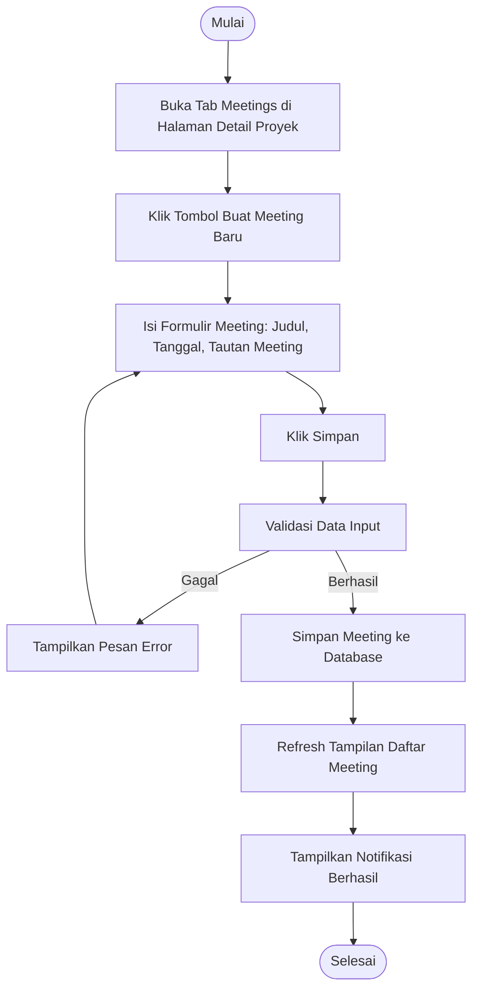

# Activity Diagram: Buat Meeting

---

## Penjelasan Activity Diagram: Buat Meeting

Activity Diagram ini menggambarkan alur kerja untuk membuat meeting baru di sistem Bitspace (hanya bisa dilakukan oleh Owner):

1. **Mulai**: Titik awal alur.
2. **Buka Tab Meetings di Halaman Detail Proyek**: Owner membuka halaman detail proyek dan memilih tab Meetings.
3. **Klik Tombol Buat Meeting Baru**: Owner menekan tombol untuk membuat meeting baru.
4. **Isi Formulir Meeting**: Owner mengisi formulir meeting seperti judul, tanggal, dan tautan meeting.
5. **Klik Simpan**: Owner menekan tombol untuk menyimpan meeting.
6. **Validasi Data Input**: Sistem memvalidasi apakah data yang dimasukkan valid.
   - **Gagal**: Jika validasi gagal, sistem menampilkan pesan error dan meminta pengguna mengisi kembali.
7. **Simpan Meeting ke Database**: Sistem menyimpan meeting baru ke database.
8. **Refresh Tampilan Daftar Meeting**: Tampilan daftar meeting diperbarui untuk menampilkan meeting baru.
9. **Tampilkan Notifikasi Berhasil**: Sistem memberitahu Owner bahwa meeting berhasil dibuat.
10. **Selesai**: Titik akhir alur.
