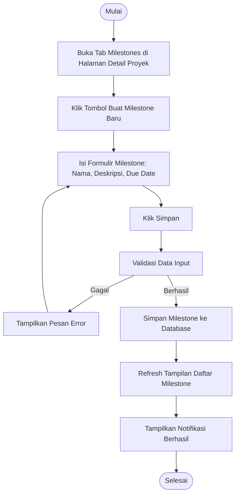

# Activity Diagram: Buat Milestone

---

## Penjelasan Activity Diagram: Buat Milestone

Activity Diagram ini menggambarkan alur kerja untuk membuat milestone baru di sistem Bitspace (hanya bisa dilakukan oleh Owner):

1. **Mulai**: Titik awal alur.
2. **Buka Tab Milestones di Halaman Detail Proyek**: Owner membuka halaman detail proyek dan memilih tab Milestones.
3. **Klik Tombol Buat Milestone Baru**: Owner menekan tombol untuk membuat milestone baru.
4. **Isi Formulir Milestone**: Owner mengisi formulir milestone seperti nama, deskripsi, dan tanggal jatuh tempo.
5. **Klik Simpan**: Owner menekan tombol untuk menyimpan milestone.
6. **Validasi Data Input**: Sistem memvalidasi apakah data yang dimasukkan valid.
   - **Gagal**: Jika validasi gagal, sistem menampilkan pesan error dan meminta pengguna mengisi kembali.
7. **Simpan Milestone ke Database**: Sistem menyimpan milestone baru ke database.
8. **Refresh Tampilan Daftar Milestone**: Tampilan daftar milestone diperbarui untuk menampilkan milestone baru.
9. **Tampilkan Notifikasi Berhasil**: Sistem memberitahu Owner bahwa milestone berhasil dibuat.
10. **Selesai**: Titik akhir alur.
