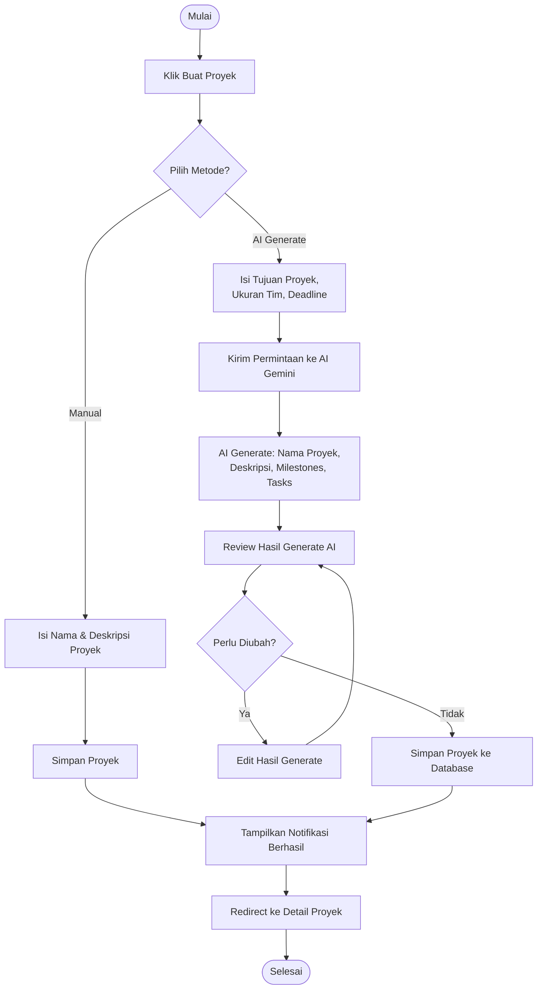

# Activity Diagram: Buat Proyek dengan AI

---

## Penjelasan Activity Diagram: Buat Proyek dengan AI

Activity Diagram ini menggambarkan alur kerja untuk membuat proyek baru di Bitspace dengan dua pilihan metode:

1. **Mulai**: Titik awal alur.
2. **Klik Buat Proyek**: Pengguna menekan tombol untuk membuat proyek baru.
3. **Pilih Metode**: Pengguna memilih apakah ingin membuat proyek secara manual atau dengan bantuan AI.
   - **Manual**: Pengguna mengisi nama dan deskripsi proyek secara manual, lalu menyimpan.
   - **AI Generate**:
     1. **Isi Prompt**: Pengguna mengisi tujuan proyek, ukuran tim, dan deadline.
     2. **Kirim Permintaan ke AI Gemini**: Sistem mengirimkan prompt ke layanan AI.
     3. **AI Generate**: AI menghasilkan nama proyek, deskripsi, milestones, dan daftar tugas secara otomatis.
     4. **Review**: Pengguna melihat dan meninjau hasil generate AI.
     5. **Perlu Diubah?**: Pengguna bisa mengedit hasil generate jika perlu sebelum menyimpan.
4. **Simpan Proyek**: Proyek disimpan ke database.
5. **Tampilkan Notifikasi Berhasil**: Sistem memberitahu pengguna bahwa proyek berhasil dibuat.
6. **Redirect ke Detail Proyek**: Pengguna diarahkan ke halaman detail proyek yang baru dibuat.
7. **Selesai**: Titik akhir alur.
