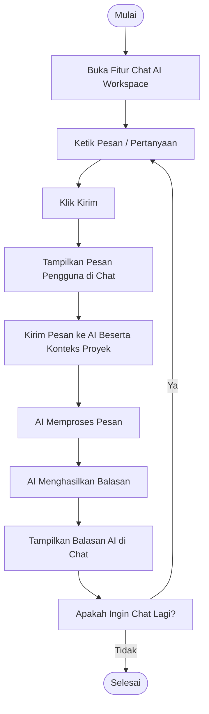

# Activity Diagram: Chat AI Workspace

---

## Penjelasan Activity Diagram: Chat AI Workspace

Activity Diagram ini menggambarkan alur kerja untuk berinteraksi dengan AI di workspace proyek di sistem Bitspace:

1. **Mulai**: Titik awal alur.
2. **Buka Fitur Chat AI Workspace**: Pengguna membuka fitur chat AI.
3. **Ketik Pesan / Pertanyaan**: Pengguna mengetik pesan atau pertanyaan tentang proyek.
4. **Klik Kirim**: Pengguna menekan tombol kirim.
5. **Tampilkan Pesan Pengguna di Chat**: Pesan pengguna ditampilkan di area chat.
6. **Kirim Pesan ke AI Beserta Konteks Proyek**: Sistem mengirim pesan pengguna beserta konteks proyek ke AI.
7. **AI Memproses Pesan**: AI memproses pesan dengan mempertimbangkan konteks proyek.
8. **AI Menghasilkan Balasan**: AI menghasilkan balasan.
9. **Tampilkan Balasan AI di Chat**: Balasan AI ditampilkan di area chat.
10. **Apakah Ingin Chat Lagi?**: Pengguna dapat memilih untuk chat lagi atau selesai.
    - **Ya**: Kembali ke langkah mengetik pesan.
    - **Tidak**: Proses selesai.
