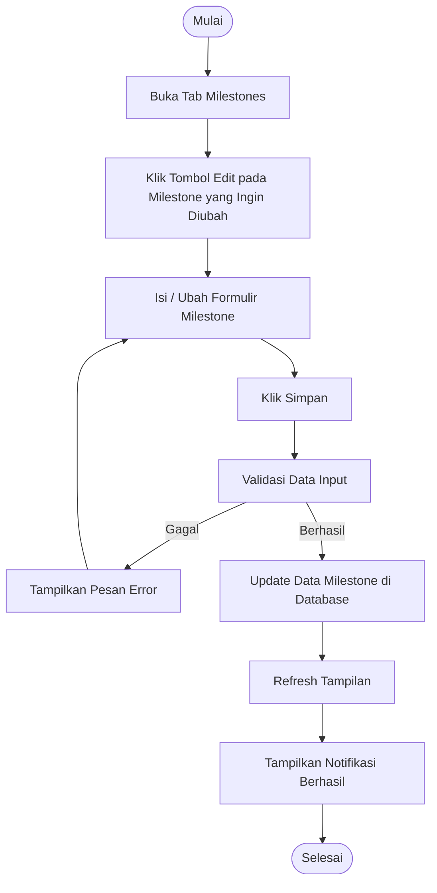

# Activity Diagram: Edit Milestone

---

## Penjelasan Activity Diagram: Edit Milestone

Activity Diagram ini menggambarkan alur kerja untuk mengedit milestone di sistem Bitspace (hanya bisa dilakukan oleh Owner):

1. **Mulai**: Titik awal alur.
2. **Buka Tab Milestones**: Owner membuka tab Milestones di halaman detail proyek.
3. **Klik Tombol Edit pada Milestone yang Ingin Diubah**: Owner menekan tombol edit pada milestone yang ingin diubah.
4. **Isi / Ubah Formulir Milestone**: Owner mengisi atau mengubah informasi milestone.
5. **Klik Simpan**: Owner menekan tombol untuk menyimpan perubahan.
6. **Validasi Data Input**: Sistem memvalidasi apakah data yang dimasukkan valid.
   - **Gagal**: Jika validasi gagal, sistem menampilkan pesan error dan meminta pengguna mengisi kembali.
7. **Update Data Milestone di Database**: Sistem menyimpan perubahan milestone ke database.
8. **Refresh Tampilan**: Tampilan diperbarui untuk menampilkan informasi terbaru.
9. **Tampilkan Notifikasi Berhasil**: Sistem memberitahu Owner bahwa milestone berhasil diperbarui.
10. **Selesai**: Titik akhir alur.
