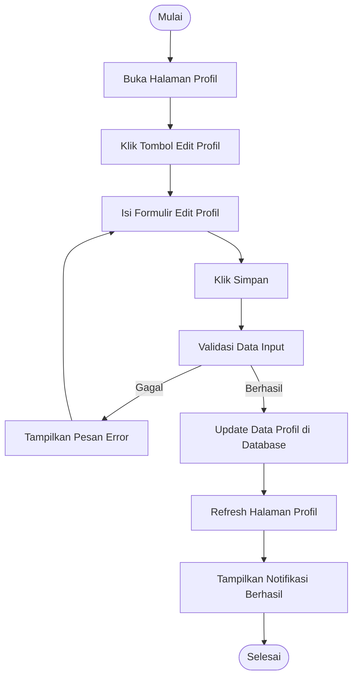

# Activity Diagram: Edit Profil

---

## Penjelasan Activity Diagram: Edit Profil

Activity Diagram ini menggambarkan alur kerja untuk mengedit profil pengguna di sistem Bitspace:

1. **Mulai**: Titik awal alur.
2. **Buka Halaman Profil**: Pengguna membuka halaman profil pribadi mereka.
3. **Klik Tombol Edit Profil**: Pengguna menekan tombol untuk mengedit profil.
4. **Isi Formulir Edit Profil**: Pengguna mengisi atau mengubah informasi profil seperti nama, dll.
5. **Klik Simpan**: Pengguna menekan tombol untuk menyimpan perubahan.
6. **Validasi Data Input**: Sistem memvalidasi apakah data yang dimasukkan valid.
   - **Gagal**: Jika validasi gagal, sistem menampilkan pesan error dan meminta pengguna mengisi kembali.
7. **Update Data Profil di Database**: Sistem menyimpan perubahan profil ke database.
8. **Refresh Halaman Profil**: Halaman profil diperbarui untuk menampilkan informasi terbaru.
9. **Tampilkan Notifikasi Berhasil**: Sistem memberitahu pengguna bahwa profil berhasil diperbarui.
10. **Selesai**: Titik akhir alur.
