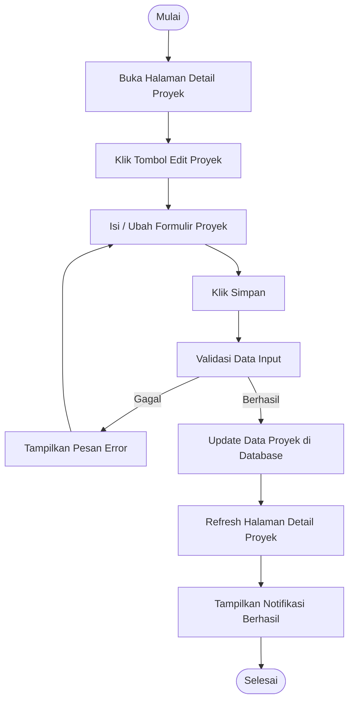

# Activity Diagram: Edit Proyek

---

## Penjelasan Activity Diagram: Edit Proyek

Activity Diagram ini menggambarkan alur kerja untuk mengedit proyek di sistem Bitspace (hanya bisa dilakukan oleh Owner):

1. **Mulai**: Titik awal alur.
2. **Buka Halaman Detail Proyek**: Owner membuka halaman detail proyek yang ingin diedit.
3. **Klik Tombol Edit Proyek**: Owner menekan tombol untuk mengedit proyek.
4. **Isi / Ubah Formulir Proyek**: Owner mengisi atau mengubah informasi proyek seperti nama, deskripsi, dll.
5. **Klik Simpan**: Owner menekan tombol untuk menyimpan perubahan.
6. **Validasi Data Input**: Sistem memvalidasi apakah data yang dimasukkan valid.
   - **Gagal**: Jika validasi gagal, sistem menampilkan pesan error dan meminta pengguna mengisi kembali.
7. **Update Data Proyek di Database**: Sistem menyimpan perubahan proyek ke database.
8. **Refresh Halaman Detail Proyek**: Halaman detail proyek diperbarui untuk menampilkan informasi terbaru.
9. **Tampilkan Notifikasi Berhasil**: Sistem memberitahu pengguna bahwa proyek berhasil diperbarui.
10. **Selesai**: Titik akhir alur.
