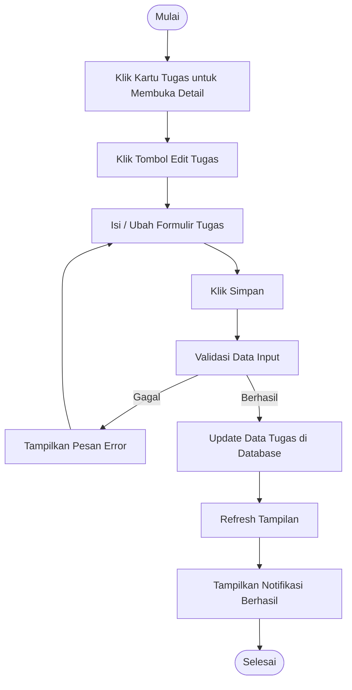

# Activity Diagram: Edit Tugas

---

## Penjelasan Activity Diagram: Edit Tugas

Activity Diagram ini menggambarkan alur kerja untuk mengedit tugas di sistem Bitspace:

1. **Mulai**: Titik awal alur.
2. **Klik Kartu Tugas untuk Membuka Detail**: Pengguna mengklik kartu tugas di kanban board untuk melihat detail tugas.
3. **Klik Tombol Edit Tugas**: Pengguna menekan tombol edit di halaman detail tugas.
4. **Isi / Ubah Formulir Tugas**: Pengguna mengisi atau mengubah informasi tugas.
5. **Klik Simpan**: Pengguna menekan tombol untuk menyimpan perubahan.
6. **Validasi Data Input**: Sistem memvalidasi apakah data yang dimasukkan valid.
   - **Gagal**: Jika validasi gagal, sistem menampilkan pesan error dan meminta pengguna mengisi kembali.
7. **Update Data Tugas di Database**: Sistem menyimpan perubahan tugas ke database.
8. **Refresh Tampilan**: Tampilan diperbarui untuk menampilkan informasi terbaru.
9. **Tampilkan Notifikasi Berhasil**: Sistem memberitahu pengguna bahwa tugas berhasil diperbarui.
10. **Selesai**: Titik akhir alur.
