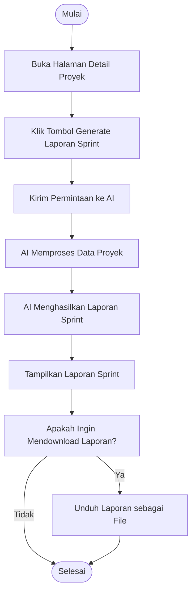

# Activity Diagram: Generate Laporan Sprint

---

## Penjelasan Activity Diagram: Generate Laporan Sprint

Activity Diagram ini menggambarkan alur kerja untuk menghasilkan laporan sprint dengan AI di sistem Bitspace:

1. **Mulai**: Titik awal alur.
2. **Buka Halaman Detail Proyek**: Pengguna membuka halaman detail proyek.
3. **Klik Tombol Generate Laporan Sprint**: Pengguna menekan tombol untuk meminta laporan sprint.
4. **Kirim Permintaan ke AI**: Sistem mengirim permintaan beserta data proyek ke AI.
5. **AI Memproses Data Proyek**: AI memproses data proyek untuk membuat laporan.
6. **AI Menghasilkan Laporan Sprint**: AI menghasilkan laporan sprint.
7. **Tampilkan Laporan Sprint**: Sistem menampilkan laporan kepada pengguna.
8. **Apakah Ingin Mendownload Laporan?**: Pengguna dapat memilih untuk mendownload laporan atau tidak.
    - **Ya**: Unduh laporan sebagai file.
    - **Tidak**: Proses selesai.
