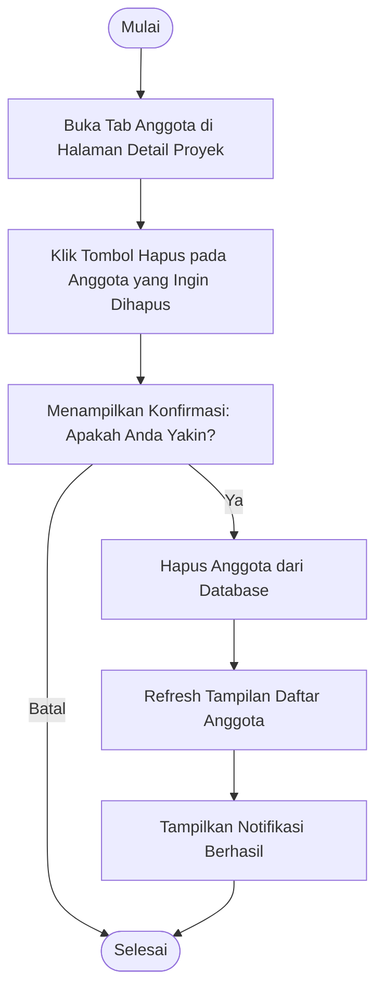

# Activity Diagram: Hapus Anggota

---

## Penjelasan Activity Diagram: Hapus Anggota

Activity Diagram ini menggambarkan alur kerja untuk menghapus anggota tim dari proyek di sistem Bitspace (hanya bisa dilakukan oleh Owner):

1. **Mulai**: Titik awal alur.
2. **Buka Tab Anggota di Halaman Detail Proyek**: Owner membuka halaman detail proyek dan memilih tab Anggota.
3. **Klik Tombol Hapus pada Anggota yang Ingin Dihapus**: Owner menekan tombol hapus pada anggota yang ingin dihapus.
4. **Menampilkan Konfirmasi**: Sistem menampilkan pesan konfirmasi untuk memastikan apakah Owner yakin.
   - **Batal**: Jika Owner memilih batal, proses selesai.
5. **Hapus Anggota dari Database**: Sistem menghapus anggota dari database proyek.
6. **Refresh Tampilan Daftar Anggota**: Tampilan daftar anggota diperbarui (anggota yang dihapus menghilang).
7. **Tampilkan Notifikasi Berhasil**: Sistem memberitahu Owner bahwa anggota berhasil dihapus.
8. **Selesai**: Titik akhir alur.
