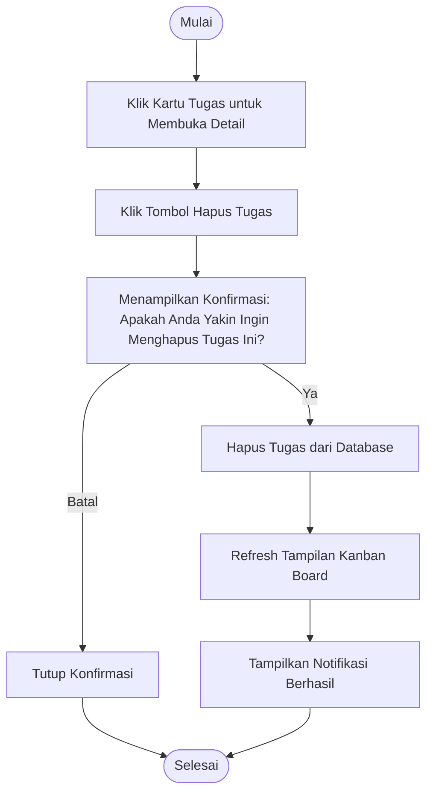

# Activity Diagram: Hapus Tugas

---

## Penjelasan Activity Diagram: Hapus Tugas

Activity Diagram ini menggambarkan alur kerja untuk menghapus tugas di sistem Bitspace (hanya bisa dilakukan oleh Owner):

1. **Mulai**: Titik awal alur.
2. **Klik Kartu Tugas untuk Membuka Detail**: Owner mengklik kartu tugas di kanban board untuk melihat detail tugas.
3. **Klik Tombol Hapus Tugas**: Owner menekan tombol hapus di halaman detail tugas.
4. **Menampilkan Konfirmasi**: Sistem menampilkan pesan konfirmasi untuk memastikan apakah Owner yakin ingin menghapus tugas.
   - **Batal**: Jika Owner memilih batal, modal konfirmasi ditutup dan proses selesai.
5. **Hapus Tugas dari Database**: Sistem menghapus tugas dari database.
6. **Refresh Tampilan Kanban Board**: Tampilan kanban board diperbarui (tugas yang dihapus menghilang).
7. **Tampilkan Notifikasi Berhasil**: Sistem memberitahu Owner bahwa tugas berhasil dihapus.
8. **Selesai**: Titik akhir alur.
