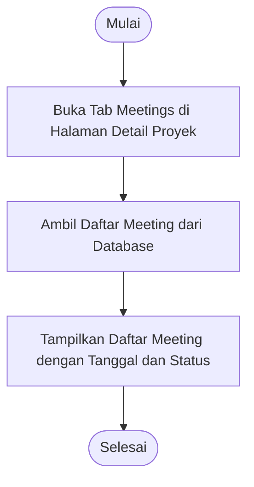

# Activity Diagram: Lihat Daftar Meeting

---

## Penjelasan Activity Diagram: Lihat Daftar Meeting

Activity Diagram ini menggambarkan alur kerja untuk melihat daftar meeting proyek di sistem Bitspace:

1. **Mulai**: Titik awal alur.
2. **Buka Tab Meetings di Halaman Detail Proyek**: Pengguna membuka halaman detail proyek dan memilih tab Meetings.
3. **Ambil Daftar Meeting dari Database**: Sistem mengambil daftar meeting proyek dari database.
4. **Tampilkan Daftar Meeting dengan Tanggal dan Status**: Sistem menampilkan daftar meeting beserta tanggal dan status.
5. **Selesai**: Titik akhir alur.
