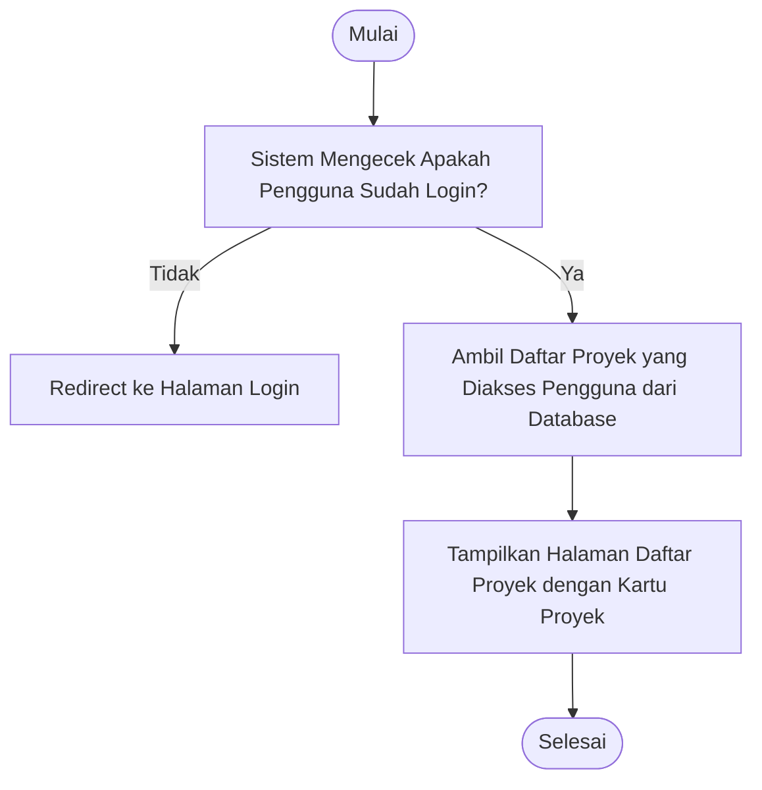

# Activity Diagram: Lihat Daftar Proyek

---

## Penjelasan Activity Diagram: Lihat Daftar Proyek

Activity Diagram ini menggambarkan alur kerja untuk melihat daftar proyek di sistem Bitspace:

1. **Mulai**: Titik awal alur.
2. **Sistem Mengecek Apakah Pengguna Sudah Login?**: Sistem memverifikasi apakah pengguna memiliki session aktif.
   - **Tidak**: Jika pengguna belum login, sistem mengarahkan ke halaman login.
3. **Ambil Daftar Proyek yang Diakses Pengguna dari Database**: Sistem mengambil daftar proyek di mana pengguna adalah owner atau member.
4. **Tampilkan Halaman Daftar Proyek dengan Kartu Proyek**: Sistem menampilkan halaman daftar proyek dengan setiap proyek ditampilkan sebagai kartu yang berisi nama, status, dan ringkasan singkat.
5. **Selesai**: Titik akhir alur.
