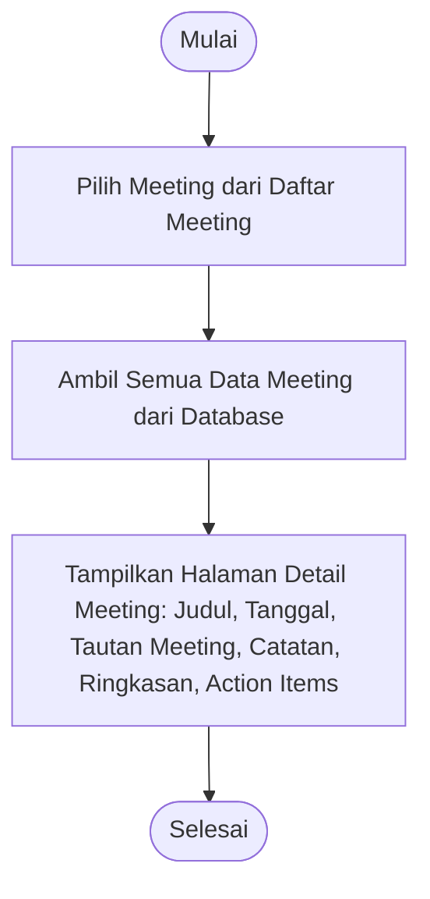

# Activity Diagram: Lihat Detail Meeting

---

## Penjelasan Activity Diagram: Lihat Detail Meeting

Activity Diagram ini menggambarkan alur kerja untuk melihat detail meeting di sistem Bitspace:

1. **Mulai**: Titik awal alur.
2. **Pilih Meeting dari Daftar Meeting**: Pengguna memilih salah satu meeting dari daftar meeting.
3. **Ambil Semua Data Meeting dari Database**: Sistem mengambil semua data meeting termasuk catatan, ringkasan, dan action items.
4. **Tampilkan Halaman Detail Meeting**: Sistem menampilkan halaman detail meeting dengan semua informasi tersebut.
5. **Selesai**: Titik akhir alur.
