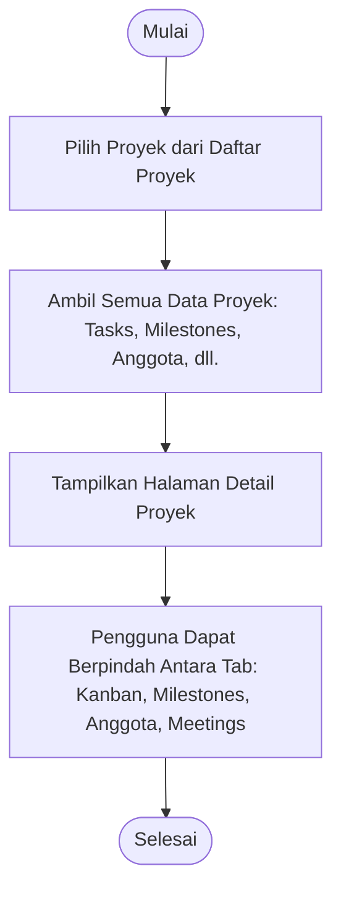

# Activity Diagram: Lihat Detail Proyek

---

## Penjelasan Activity Diagram: Lihat Detail Proyek

Activity Diagram ini menggambarkan alur kerja untuk melihat detail proyek di sistem Bitspace:

1. **Mulai**: Titik awal alur.
2. **Pilih Proyek dari Daftar Proyek**: Pengguna memilih salah satu proyek dari daftar proyek.
3. **Ambil Semua Data Proyek**: Sistem mengambil semua data terkait proyek termasuk tasks, milestones, anggota tim, meetings, dan activity log.
4. **Tampilkan Halaman Detail Proyek**: Sistem menampilkan halaman detail proyek dengan navigasi tab.
5. **Pengguna Dapat Berpindah Antara Tab**: Pengguna dapat berpindah antara tab:
   - Kanban (untuk melihat dan mengelola tugas)
   - Milestones (untuk melihat milestones proyek)
   - Anggota (untuk melihat anggota tim)
   - Meetings (untuk melihat daftar meeting proyek)
6. **Selesai**: Titik akhir alur.
