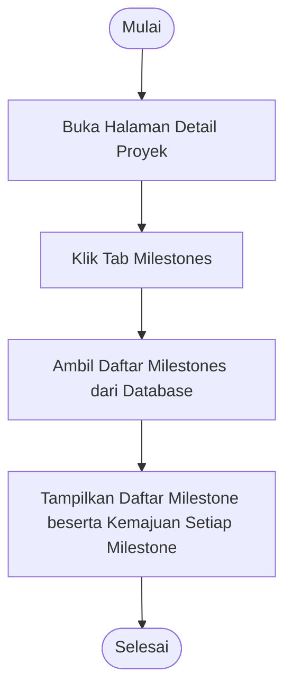

# Activity Diagram: Lihat Milestone

---

## Penjelasan Activity Diagram: Lihat Milestone

Activity Diagram ini menggambarkan alur kerja untuk melihat milestone proyek di sistem Bitspace:

1. **Mulai**: Titik awal alur.
2. **Buka Halaman Detail Proyek**: Pengguna membuka halaman detail proyek.
3. **Klik Tab Milestones**: Pengguna memilih tab Milestones.
4. **Ambil Daftar Milestones dari Database**: Sistem mengambil daftar milestone proyek beserta kemajuannya.
5. **Tampilkan Daftar Milestone beserta Kemajuan Setiap Milestone**: Sistem menampilkan daftar milestone dengan bar kemajuan dan tugas yang terkait.
6. **Selesai**: Titik akhir alur.
