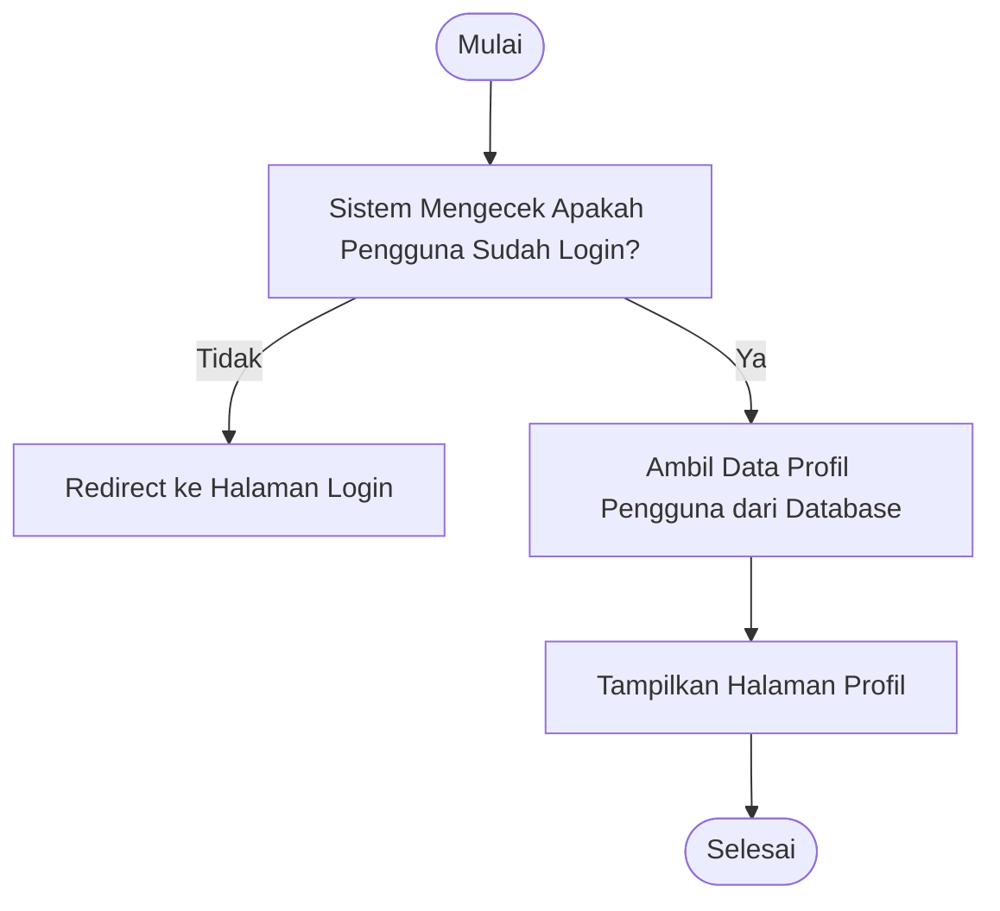

# Activity Diagram: Lihat Profil

---

## Penjelasan Activity Diagram: Lihat Profil

Activity Diagram ini menggambarkan alur kerja untuk melihat profil pengguna di sistem Bitspace:

1. **Mulai**: Titik awal alur.
2. **Sistem Mengecek Apakah Pengguna Sudah Login?**: Sistem memverifikasi apakah pengguna memiliki session aktif.
   - **Tidak**: Jika pengguna belum login, sistem mengarahkan ke halaman login.
3. **Ambil Data Profil Pengguna dari Database**: Sistem mengambil informasi profil pengguna dari database.
4. **Tampilkan Halaman Profil**: Sistem menampilkan halaman profil beserta informasi pengguna seperti nama, email, avatar, dan peran.
5. **Selesai**: Titik akhir alur.
