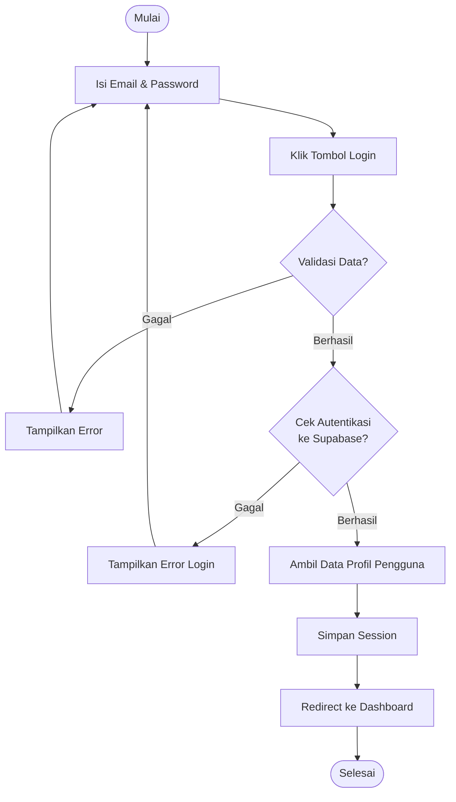

# Activity Diagram: Login Pengguna

---

## Penjelasan Activity Diagram: Login Pengguna

Activity Diagram ini menggambarkan alur kerja untuk login pengguna ke sistem Bitspace:

1. **Mulai**: Titik awal alur.
2. **Isi Email & Password**: Pengguna memasukkan kredensial login mereka.
3. **Klik Tombol Login**: Pengguna menekan tombol untuk masuk.
4. **Validasi Data**: Sistem memeriksa apakah data yang dimasukkan valid (format email benar, password tidak kosong).
   - Jika gagal: Tampilkan pesan error dan minta pengguna mengisi kembali.
5. **Cek Autentikasi ke Supabase**: Sistem mengirimkan kredensial ke Supabase Auth untuk diverifikasi.
   - Jika gagal: Tampilkan pesan error login dan minta pengguna mengisi kembali.
6. **Ambil Data Profil Pengguna**: Setelah autentikasi berhasil, sistem mengambil data profil pengguna dari database.
7. **Simpan Session**: Sistem menyimpan session pengguna di browser untuk tetap login.
8. **Redirect ke Dashboard**: Pengguna diarahkan ke halaman dashboard utama.
9. **Selesai**: Titik akhir alur.
