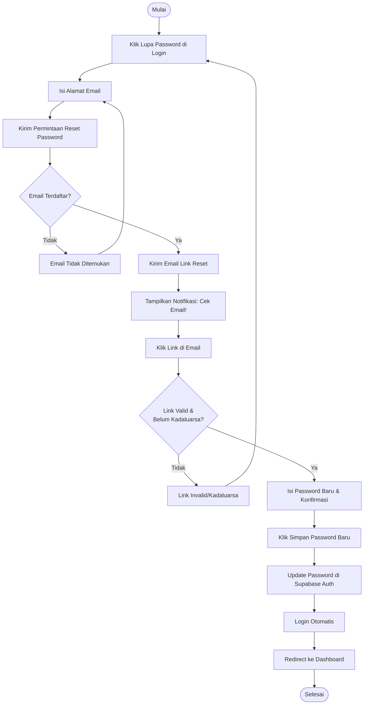

# Activity Diagram: Reset Password

---

## Penjelasan Activity Diagram: Reset Password

Activity Diagram ini menggambarkan alur kerja untuk mereset password pengguna yang lupa:

1. **Mulai**: Titik awal alur.
2. **Klik Lupa Password di Login**: Pengguna menekan tautan "Lupa Password" di halaman login.
3. **Isi Alamat Email**: Pengguna memasukkan alamat email yang terdaftar.
4. **Kirim Permintaan Reset Password**: Sistem mengirim permintaan ke Supabase Auth.
5. **Email Terdaftar?**: Sistem memeriksa apakah email tersebut ada di database.
   - Jika tidak: Tampilkan error dan minta pengguna mengisi email lain.
6. **Kirim Email Link Reset**: Supabase mengirimkan email berisi tautan reset password ke pengguna.
7. **Tampilkan Notifikasi: Cek Email!**: Sistem memberitahu pengguna untuk memeriksa email mereka.
8. **Klik Link di Email**: Pengguna membuka email dan mengklik tautan reset password.
9. **Link Valid & Belum Kadaluarsa?**: Sistem memverifikasi apakah tautan masih berlaku dan belum kadaluarsa.
   - Jika tidak: Tampilkan error dan minta pengguna meminta tautan baru.
10. **Isi Password Baru & Konfirmasi**: Pengguna memasukkan password baru dan mengonfirmasinya.
11. **Klik Simpan Password Baru**: Pengguna menekan tombol untuk menyimpan password baru.
12. **Update Password di Supabase Auth**: Sistem memperbarui password pengguna di database.
13. **Login Otomatis**: Pengguna secara otomatis login ke sistem.
14. **Redirect ke Dashboard**: Pengguna diarahkan ke halaman dashboard.
15. **Selesai**: Titik akhir alur.
