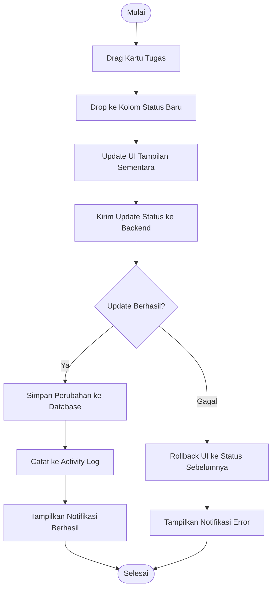

# Activity Diagram: Ubah Status Tugas (Drag & Drop)

---

## Penjelasan Activity Diagram: Ubah Status Tugas (Drag & Drop)

Activity Diagram ini menggambarkan alur kerja untuk mengubah status tugas dengan cara drag and drop:

1. **Mulai**: Titik awal alur.
2. **Drag Kartu Tugas**: Pengguna menggeser kartu tugas dari kolom status lama.
3. **Drop ke Kolom Status Baru**: Pengguna meletakkan kartu tugas ke kolom status yang baru (misal dari `TODO` ke `IN_PROGRESS`).
4. **Update UI Tampilan Sementara**: Sistem memperbarui tampilan di browser secara lokal untuk memberikan feedback cepat kepada pengguna.
5. **Kirim Update Status ke Backend**: Sistem mengirim permintaan ke backend untuk memperbarui status tugas di database.
6. **Update Berhasil?**: Sistem memeriksa apakah permintaan ke backend berhasil.
   - **Ya**:
     1. **Simpan Perubahan ke Database**: Backend menyimpan perubahan status tugas.
     2. **Catat ke Activity Log**: Sistem mencatat perubahan ini ke log aktivitas proyek.
     3. **Tampilkan Notifikasi Berhasil**: Sistem memberitahu pengguna bahwa perubahan berhasil disimpan.
   - **Tidak**:
     1. **Rollback UI ke Status Sebelumnya**: Sistem mengembalikan tampilan ke kondisi sebelum drag and drop.
     2. **Tampilkan Notifikasi Error**: Sistem memberitahu pengguna bahwa terjadi kesalahan dan perubahan tidak disimpan.
7. **Selesai**: Titik akhir alur.
