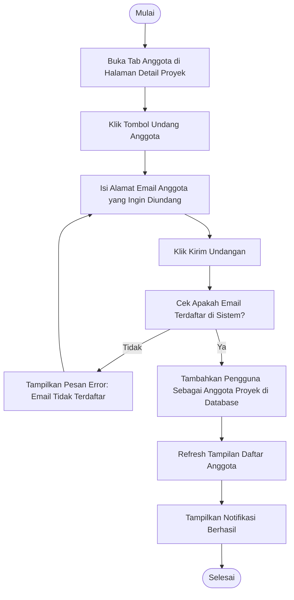

# Activity Diagram: Undang Anggota

---

## Penjelasan Activity Diagram: Undang Anggota

Activity Diagram ini menggambarkan alur kerja untuk mengundang anggota tim ke proyek di sistem Bitspace (hanya bisa dilakukan oleh Owner):

1. **Mulai**: Titik awal alur.
2. **Buka Tab Anggota di Halaman Detail Proyek**: Owner membuka halaman detail proyek dan memilih tab Anggota.
3. **Klik Tombol Undang Anggota**: Owner menekan tombol untuk mengundang anggota baru.
4. **Isi Alamat Email Anggota yang Ingin Diundang**: Owner mengisi alamat email pengguna yang ingin diundang.
5. **Klik Kirim Undangan**: Owner menekan tombol untuk mengirim undangan.
6. **Cek Apakah Email Terdaftar di Sistem?**: Sistem memeriksa apakah email tersebut sudah terdaftar di sistem.
   - **Tidak**: Jika email tidak terdaftar, sistem menampilkan pesan error dan meminta Owner mengisi email lain.
7. **Tambahkan Pengguna Sebagai Anggota Proyek di Database**: Sistem menambahkan pengguna tersebut sebagai anggota proyek di database.
8. **Refresh Tampilan Daftar Anggota**: Tampilan daftar anggota diperbarui untuk menampilkan anggota baru.
9. **Tampilkan Notifikasi Berhasil**: Sistem memberitahu Owner bahwa anggota berhasil diundang.
10. **Selesai**: Titik akhir alur.
