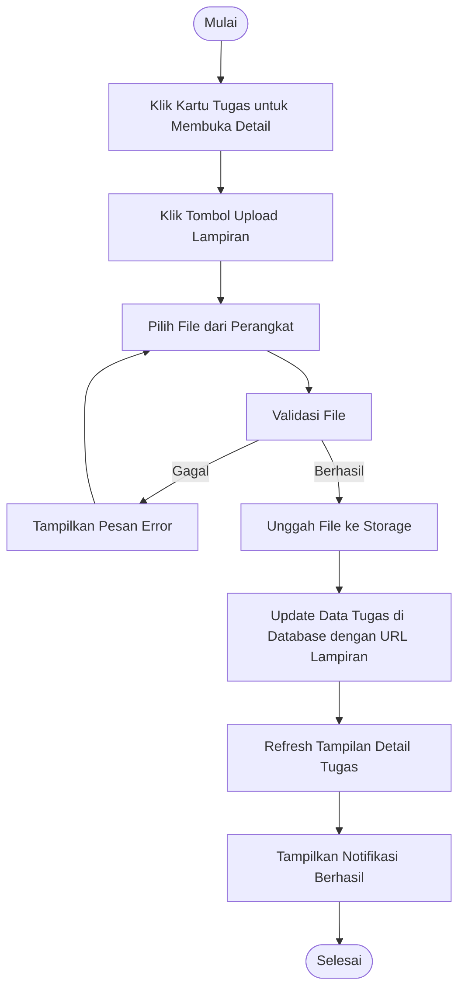

# Activity Diagram: Upload Lampiran Tugas

---

## Penjelasan Activity Diagram: Upload Lampiran Tugas

Activity Diagram ini menggambarkan alur kerja untuk mengunggah lampiran ke tugas di sistem Bitspace:

1. **Mulai**: Titik awal alur.
2. **Klik Kartu Tugas untuk Membuka Detail**: Pengguna mengklik kartu tugas di kanban board untuk melihat detail tugas.
3. **Klik Tombol Upload Lampiran**: Pengguna menekan tombol upload lampiran.
4. **Pilih File dari Perangkat**: Pengguna memilih file dari perangkat mereka.
5. **Validasi File**: Sistem memvalidasi file (format dan ukuran).
   - **Gagal**: Jika validasi gagal, sistem menampilkan pesan error dan meminta pengguna memilih file lain.
6. **Unggah File ke Storage**: Sistem mengunggah file ke storage.
7. **Update Data Tugas di Database dengan URL Lampiran**: Sistem menyimpan URL lampiran ke database tugas.
8. **Refresh Tampilan Detail Tugas**: Tampilan detail tugas diperbarui untuk menampilkan lampiran baru.
9. **Tampilkan Notifikasi Berhasil**: Sistem memberitahu pengguna bahwa lampiran berhasil diunggah.
10. **Selesai**: Titik akhir alur.
