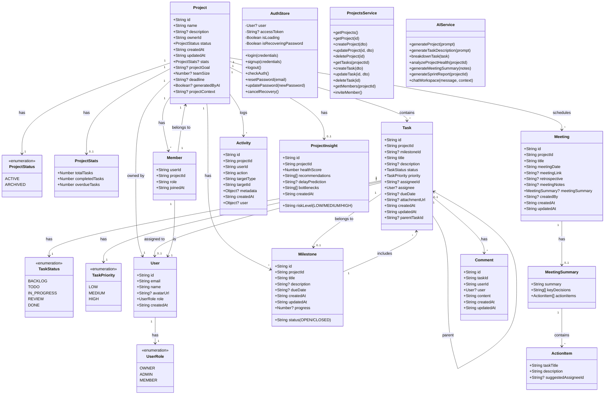

# Class Diagram Bitspace

---

## Penjelasan Class Diagram

Class Diagram ini menggambarkan struktur data (entitas) dan layanan (services) dalam sistem Bitspace:

### 1. Enums
- **UserRole**: Peran pengguna (OWNER, ADMIN, MEMBER).
- **ProjectStatus**: Status proyek (ACTIVE, ARCHIVED).
- **TaskStatus**: Status tugas (BACKLOG, TODO, IN_PROGRESS, REVIEW, DONE).
- **TaskPriority**: Prioritas tugas (LOW, MEDIUM, HIGH).

### 2. Entitas Utama
- **User**: Data pengguna aplikasi.
- **Project**: Data proyek, termasuk goal dan AI fields.
- **Task**: Data tugas dalam proyek.
- **Milestone**: Data milestone proyek.
- **Member**: Hubungan antara pengguna dan proyek (anggota tim).
- **Meeting**: Data meeting proyek beserta ringkasannya.
- **Activity**: Log aktivitas dalam proyek.
- **Comment**: Komentar pada tugas.
- **ProjectInsight**: Analisis kesehatan proyek dari AI.

### 3. Layanan (Services)
- **AuthStore**: State management autentikasi.
- **ProjectsService**: Layanan operasi proyek dan tugas.
- **AIService**: Layanan integrasi dengan AI Gemini.

### 4. Hubungan Antar Kelas
- **1 to 1**: Misal User punya 1 UserRole.
- **1 to Many**: Misal 1 Project punya banyak Task.
- **0 to 1**: Hubungan opsional, misal Project boleh tidak punya ProjectStats.
