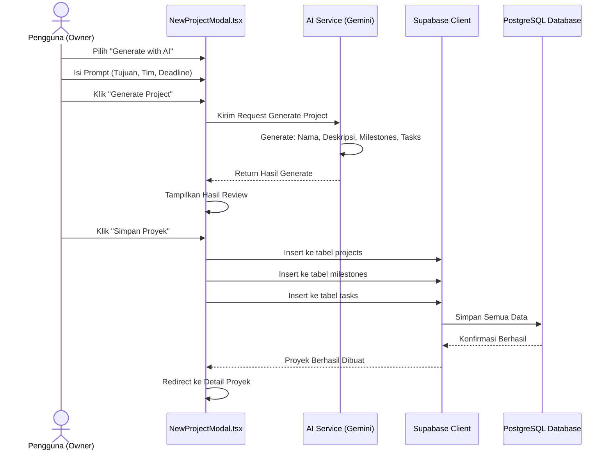

# Sequence Diagram: Buat Proyek dengan AI

---

## Penjelasan Sequence Diagram: Buat Proyek dengan AI

Sequence Diagram ini menggambarkan alur interaksi ketika pengguna membuat proyek dengan bantuan AI Gemini:

1. **Pengguna (Owner)**: Memilih opsi "Generate with AI".
2. **Pengguna**: Mengisi prompt berisi tujuan proyek, ukuran tim, dan deadline.
3. **Pengguna**: Klik tombol "Generate Project".
4. **NewProjectModal.tsx**: Mengirim permintaan ke AI Service (Gemini).
5. **AI Service**: Memproses permintaan dan menghasilkan nama proyek, deskripsi, milestones, dan tasks.
6. **AI Service**: Mengembalikan hasil generate ke `NewProjectModal.tsx`.
7. **NewProjectModal.tsx**: Menampilkan hasil generate untuk direview oleh pengguna.
8. **Pengguna**: Klik tombol "Simpan Proyek" setelah review.
9. **NewProjectModal.tsx**: Menyimpan proyek, milestones, dan tasks ke database melalui Supabase Client.
10. **Supabase Client**: Menyimpan semua data ke PostgreSQL Database.
11. **PostgreSQL Database**: Mengonfirmasi bahwa semua data berhasil disimpan.
12. **Supabase Client**: Memberitahu `NewProjectModal.tsx` bahwa proyek berhasil dibuat.
13. **NewProjectModal.tsx**: Mengarahkan pengguna ke halaman detail proyek yang baru dibuat.
