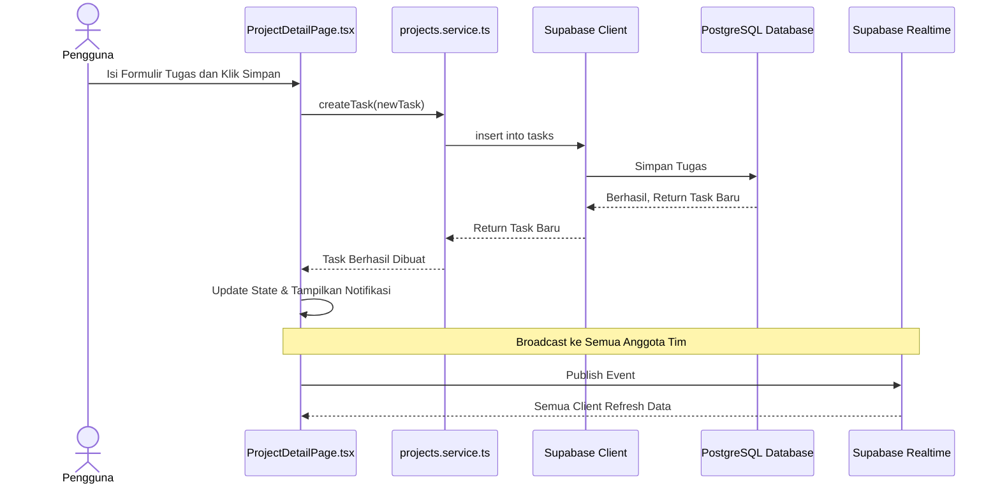

# Sequence Diagram: Buat Tugas

---

## Penjelasan Sequence Diagram: Buat Tugas

Sequence Diagram ini menggambarkan alur interaksi ketika pengguna membuat tugas baru di sistem Bitspace:

1. **Pengguna**: Mengisi formulir tugas dan klik simpan di halaman detail proyek.
2. **ProjectDetailPage.tsx**: Memanggil fungsi `createTask` di `projects.service.ts`.
3. **projects.service.ts**: Memanggil `insert` ke Supabase Client.
4. **Supabase Client**: Menyimpan tugas ke PostgreSQL Database.
5. **PostgreSQL Database**: Mengembalikan tugas baru yang berhasil disimpan.
6. **Supabase Client**: Mengembalikan tugas baru ke `projects.service.ts`.
7. **projects.service.ts**: Memberitahu `ProjectDetailPage.tsx` bahwa tugas berhasil dibuat.
8. **ProjectDetailPage.tsx**: Memperbarui state dan menampilkan notifikasi berhasil.
9. **Realtime**: Perubahan dikirim ke semua anggota tim secara realtime.
