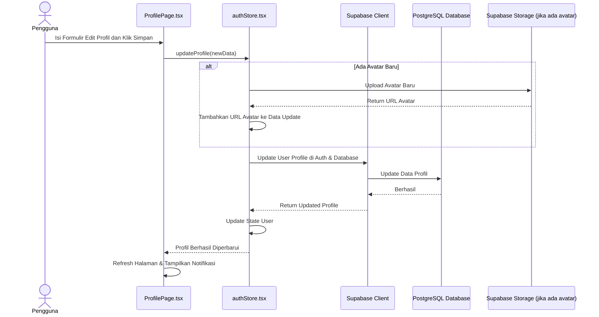

# Sequence Diagram: Edit Profil

---

## Penjelasan Sequence Diagram: Edit Profil

Sequence Diagram ini menggambarkan alur interaksi ketika pengguna mengedit profil di sistem Bitspace:

1. **Pengguna**: Mengisi formulir edit profil dan klik simpan di halaman profil.
2. **ProfilePage.tsx**: Memanggil fungsi `updateProfile` di `authStore.tsx`.
3. **(Opsional) Upload Avatar Baru**: Jika pengguna mengunggah avatar baru, avatar diunggah ke storage dan URLnya ditambahkan ke data update.
4. **authStore.tsx**: Memperbarui data profil pengguna di Supabase Auth dan Database.
5. **Supabase Client**: Memperbarui data di PostgreSQL Database.
6. **PostgreSQL Database**: Mengonfirmasi bahwa perubahan berhasil disimpan.
7. **authStore.tsx**: Memperbarui state user.
8. **ProfilePage.tsx**: Memperbarui halaman dan menampilkan notifikasi berhasil.
