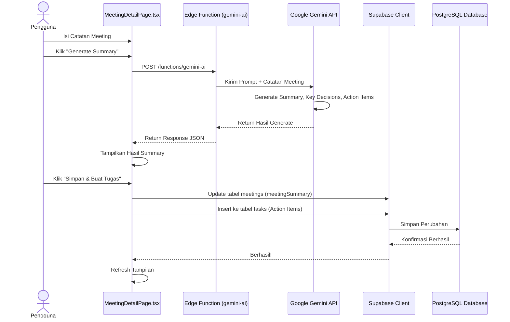

# Sequence Diagram: Generate Ringkasan Meeting dengan AI

---

## Penjelasan Sequence Diagram: Generate Ringkasan Meeting dengan AI

Sequence Diagram ini menggambarkan alur interaksi ketika pengguna menghasilkan ringkasan meeting dengan bantuan AI:

1. **Pengguna**: Mengisi catatan meeting di halaman detail meeting.
2. **Pengguna**: Klik tombol "Generate Summary".
3. **MeetingDetailPage.tsx**: Mengirim permintaan ke Edge Function `gemini-ai`.
4. **Edge Function**: Meneruskan prompt dan catatan meeting ke Google Gemini API.
5. **Google Gemini API**: Memproses dan menghasilkan summary, key decisions, dan action items.
6. **Google Gemini API**: Mengembalikan hasil generate ke Edge Function.
7. **Edge Function**: Mengembalikan response JSON ke `MeetingDetailPage.tsx`.
8. **MeetingDetailPage.tsx**: Menampilkan hasil summary kepada pengguna.
9. **Pengguna**: Klik tombol "Simpan & Buat Tugas".
10. **MeetingDetailPage.tsx**: Memperbarui tabel `meetings` dan menambahkan tugas baru ke tabel `tasks`.
11. **Supabase Client**: Menyimpan semua perubahan ke PostgreSQL Database.
12. **PostgreSQL Database**: Mengonfirmasi bahwa semua perubahan berhasil disimpan.
13. **Supabase Client**: Memberitahu `MeetingDetailPage.tsx` bahwa operasi berhasil.
14. **MeetingDetailPage.tsx**: Memperbarui tampilan halaman.
