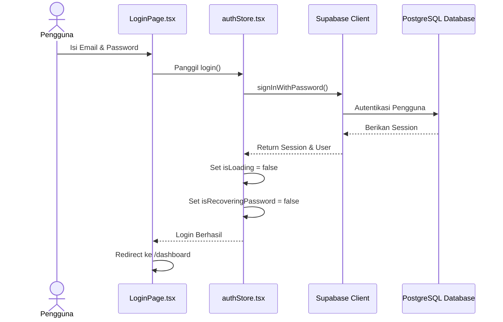

# Sequence Diagram: Login Pengguna

---

## Penjelasan Sequence Diagram: Login Pengguna

Sequence Diagram ini menggambarkan alur interaksi secara terurut ketika pengguna melakukan login ke sistem Bitspace:

1. **Pengguna**: Memasukkan alamat email dan password ke halaman login.
2. **LoginPage.tsx**: Menerima input pengguna dan memanggil fungsi `login()` di `authStore.tsx`.
3. **authStore.tsx**: Memanggil method `signInWithPassword()` dari Supabase Client untuk autentikasi.
4. **Supabase Client**: Mengirim permintaan autentikasi ke PostgreSQL Database.
5. **PostgreSQL Database**: Memverifikasi kredensial dan mengembalikan session jika valid.
6. **Supabase Client**: Mengembalikan session dan data pengguna ke `authStore.tsx`.
7. **authStore.tsx**: Memperbarui state (set `isLoading` dan `isRecoveringPassword` ke false).
8. **authStore.tsx**: Memberitahu `LoginPage.tsx` bahwa login berhasil.
9. **LoginPage.tsx**: Mengarahkan pengguna ke halaman `/dashboard`.
