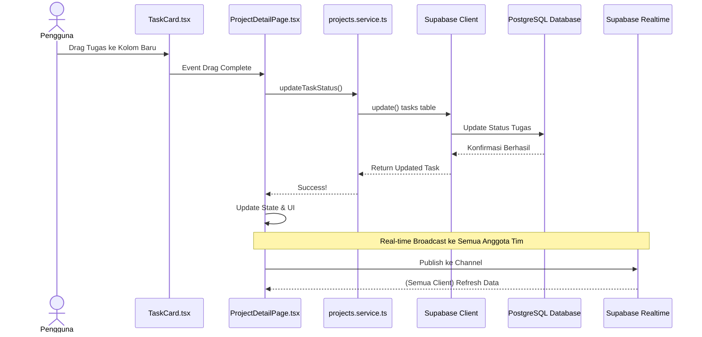

# Sequence Diagram: Ubah Status Tugas (Drag & Drop)

---

## Penjelasan Sequence Diagram: Ubah Status Tugas (Drag & Drop)

Sequence Diagram ini menggambarkan alur interaksi ketika pengguna mengubah status tugas dengan drag and drop beserta real-time broadcast:

1. **Pengguna**: Menggeser (drag) kartu tugas ke kolom status baru.
2. **TaskCard.tsx**: Memberitahu `ProjectDetailPage.tsx` bahwa drag selesai.
3. **ProjectDetailPage.tsx**: Memanggil `updateTaskStatus()` di `projects.service.ts`.
4. **projects.service.ts**: Memanggil method `update()` di Supabase Client.
5. **Supabase Client**: Memperbarui status tugas di PostgreSQL Database.
6. **PostgreSQL Database**: Mengonfirmasi bahwa perubahan berhasil disimpan.
7. **Supabase Client**: Mengembalikan task yang diperbarui ke `projects.service.ts`.
8. **projects.service.ts**: Memberitahu `ProjectDetailPage.tsx` bahwa update berhasil.
9. **ProjectDetailPage.tsx**: Memperbarui state dan tampilan UI.
10. **Realtime Broadcast**: `ProjectDetailPage.tsx` mempublikasikan perubahan ke channel Supabase Realtime.
11. **Supabase Realtime**: Menyiarkan perubahan ke semua client lain yang terhubung, sehingga semua anggota tim melihat perubahan secara real-time.
