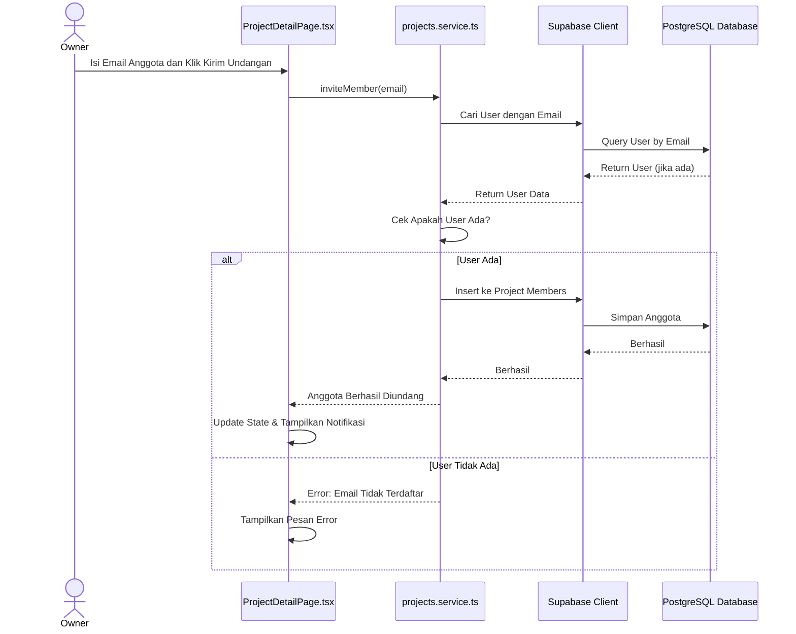

# Sequence Diagram: Undang Anggota

---

## Penjelasan Sequence Diagram: Undang Anggota

Sequence Diagram ini menggambarkan alur interaksi ketika Owner mengundang anggota baru ke proyek di sistem Bitspace:

1. **Owner**: Mengisi email anggota dan klik kirim undangan di halaman detail proyek.
2. **ProjectDetailPage.tsx**: Memanggil fungsi `inviteMember` di `projects.service.ts`.
3. **projects.service.ts**: Meminta Supabase untuk mencari user dengan email tersebut.
4. **Supabase Client**: Mencari user di PostgreSQL Database.
5. **PostgreSQL Database**: Mengembalikan data user jika ditemukan.
6. **projects.service.ts**: Memeriksa apakah user ada.
   - **User Ada**: Menyimpan user sebagai anggota proyek dan memberitahu berhasil.
   - **User Tidak Ada**: Memberitahu error bahwa email tidak terdaftar.
